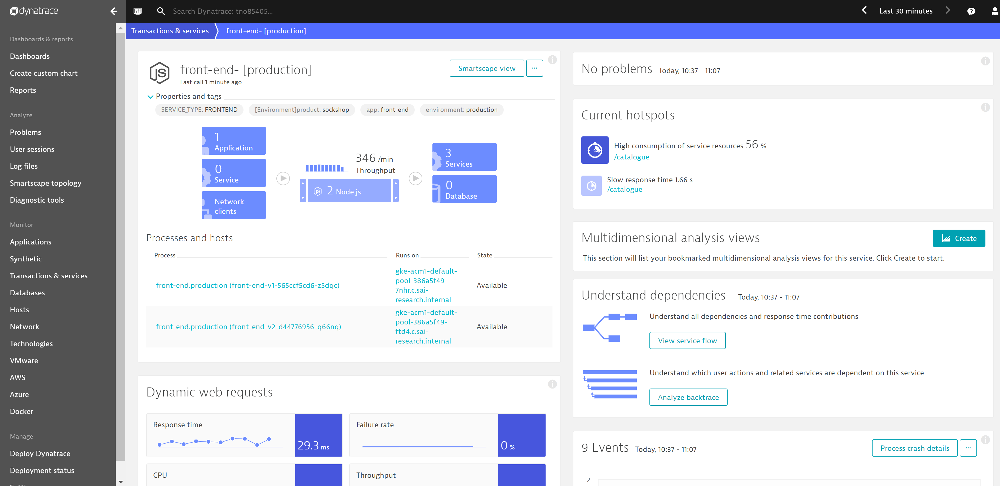
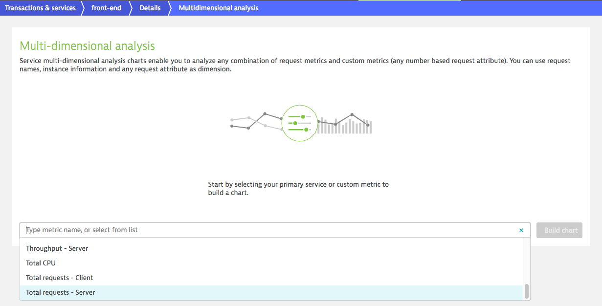
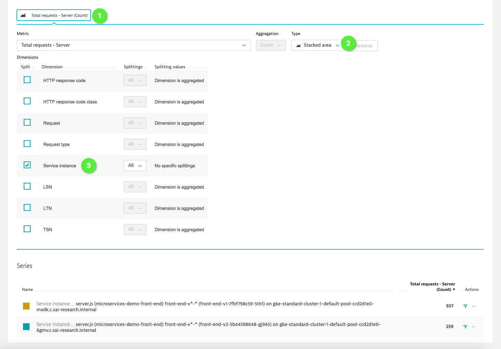
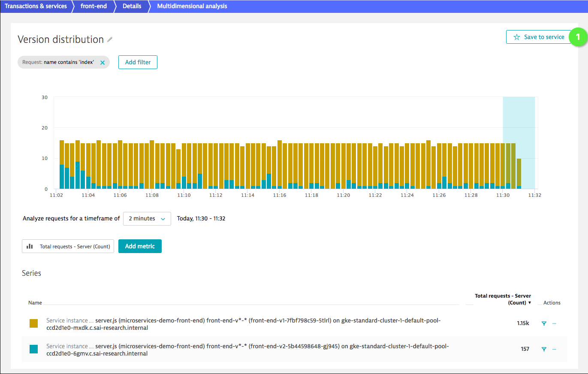

# Deploy front-end v2

In this lab, we'll configure traffic routing in Istio to redirect traffic based on different criteria to the version 2 of the `front-end`. We'll cover how to redirect traffic using weight rules, redirecting only logged in users to the version 2, and redirecting only Chrome users to version 2.

## Data needed
(nil)

## Steps
1. Right now, traffic to `front-end` is only routed to the version 1, because we've configured the `VirtualService` to do exactly that. The `subset: v1` entry in the configuration takes care of that.

    ```
    apiVersion: networking.istio.io/v1alpha3
    kind: VirtualService
    metadata:
    name: sockshop
    spec:
    hosts:
    - "*"
    gateways:
    - sockshop-gateway
    http:
    - route:
        - destination:
            host: front-end.production.svc.cluster.local
            subset: v1
    ```

1. To see if the new version works properly we only want 10% of the traffic to be redirected to that version initially. To that end, we modify the `virtual-service-canary.yml` in the `k8s-deploy-production` repository and apply it.

    ```
    (bastion)$ pwd
    ~/repositories/k8s-deploy-production/istio
    (bastion)$ vi virtual-service-canary.yml
    ...
    ```

    Edit the file like this:

    **!!! YOU MUST NOT DELETE THE COMMENTS #v1 AND #v2 - WE NEED THOSE LATER ON !!!**

    

    This configuration redirects 10% of all traffic hitting the sockshop `VirtualService` to version 2. Let's take a look how that looks in Dynatrace.

1. Open Dynatrace and navigate to Transactions&Services and open the `front-end` service screen.

    

    You see, that there are two service instances to the `front-end` service, i.e. the two different deployments we've done earlier, as you can see in the brackets of the processes (front-end-v1-... and front-end-v2-...). Dynatrace is aware of the two versions.

1. Let's create a chart in Dynatrace that shows the traffic distribution between two service versions. To that end, click on the "Create" button in the "Multidimensional analysis views" section on the service screen. In the next screen select the metric `Total requests - Server` and click "Build chart"

    

1. Rename the chart and configure the filter so only requests that contain the string `index` are taken into account for that chart. By doing that, we filter out the readiness and liveness probe requests.

    

1. Click on the metric :one: under the chart, select either "Stacked Area" or "Stacked Bar" chart :two:, and select "Service instance" as dimension :three:.

    

1. Your chart should now look something like this, already showing the traffic distribution between the two service instances. Finally, click the "Save to Service" button :one: in the upper right corner, so you can easily access this chart form the service overview from now on.

    

1. You can now change the weight distribution of verison 1 and 2 to arbitrary values and see it reflect in the chart you've just created.

1. (Optional) You can decide traffic routing also based on information that is included in the HTTP header. For example, you can present version 2 only to users that are logged in. See the following configuration that enables that.

    ```
    apiVersion: networking.istio.io/v1alpha3
    kind: VirtualService
    metadata:
    name: sockshop
    spec:
    hosts:
    - "*"
    gateways:
    - sockshop-gateway
    http:
    - match:
        - headers:
            cookie:
            regex: ".*logged_in.*"
        route:
        - destination:
            host: front-end.production.svc.cluster.local
            subset: v2
    - route:
        - destination:
            host: front-end.production.svc.cluster.local
            subset: v1
    ```

    Istio checks if the cookie field of the HTTP header contains the string `logged_in` using regular expressions. This, of course, depends on the implementation of your web application and is not univesally appllicable. To set this in action apply the configuration.

    ```
    (bastion)$ kubectl apply -f virtual_service_v2_for_users.yml
    ```

    If you login using either a new registrated user, or a user that you've created before, you should see version 2. After logging out, you should see verison 1 again.

1. (Optional) Another option is to redirect traffic based on the user browser. See the following configuration that enables that.

    ```
    apiVersion: networking.istio.io/v1alpha3
    kind: VirtualService
    metadata:
    name: sockshop
    spec:
    hosts:
    - "*"
    gateways:
    - sockshop-gateway
    http:
    - match:
        - headers:
            user-agent:
            regex: ".*Chrome.*"
        route:
        - destination:
            host: front-end.production.svc.cluster.local
            subset: v2
    - route:
        - destination:
            host: front-end.production.svc.cluster.local
            subset: v1
    ```

    You can apply the configuration to see its effect.

    ```
    (bastion)$ kubectl apply -f virtual_service_v2_for_chrome.yml
    ```

    If you open sockshop using Chrome you should see version 2, with any other version 1 should be displayed.

1. Eventually, trigger the parameterized build pipeline `k8s-deploy-production.canary` in your Jenkins instance and provide 100 for the VERSION1 parameter and 0 for the VERSION2 parameter. This build calls a build pipeline that applies the supplied distribution to the `front-end` service and also sends a change event to Dynatrace.

    

    This, of course, is the preferred way to change the attributes of production deployments. If you change something directly from your command line and don't send a change event, you'll have a hard time figuring out why and what happened when.

---
[Previous Step: Deploy front-end v2](../5_Deploy_front-end_v2) :arrow_backward:

:arrow_up_small: [Back to overview](../)
